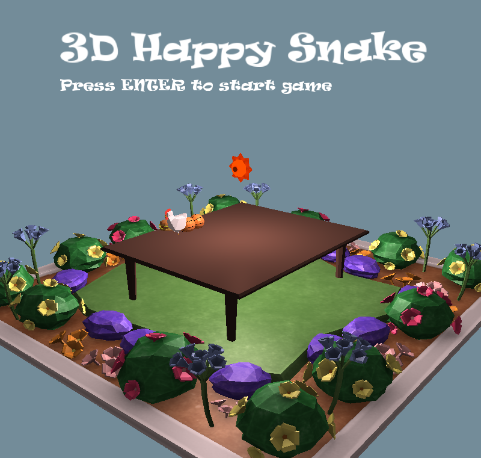

# Retro Snaker

贪吃蛇小游戏 以及 智能寻路算法

## Using

### OpenGL

OpenGL 窗口化版本

[开发过程](https://blog.zhenly.cn/CG/OpenGL_RetroSnaker/)

操作：

- `WASD` 或 `方向键` 控制方向
- `345` 和 `678` 切换皮肤
- `0` 开启作弊模式

### Online

局域网多人版

基于OpenGL版开发，使用UDP实现状态同步

[开发过程](https://blog.zhenly.cn/CG/OpenGL_NetworkGame/)

### Console

控制台版本

- 仅支持 linux

### AI

智能算法自动寻路展示

- 支持 linux 和 windows
- 一般情况下可以占满所有格子(8x8)
- 使用 DFS + 追尾策略 寻路

### SCM

基于 51 单片机的版本

## Download

[下载可执行文件](https://github.com/ZhenlyChen/RetroSnaker/releases)
